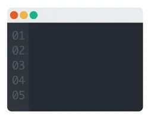

# 💫 About Me:
Computer Science Student @ FH Aachen | Aspiring Software Developer & Cybersecurity Enthusiast | Low-Level Programming (AVR/C)

  

## 🌐 Socials:
 

# 💻 Tech Stack:
                      
# 📊 GitHub Stats:
 
 

---

